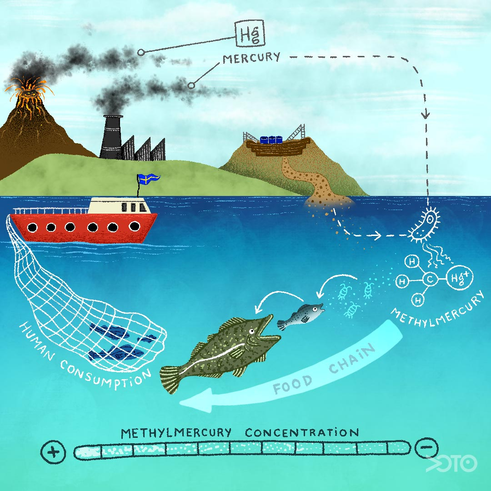

<html lang="en">
<head>
    <meta charset="UTF-8">
    <meta name="viewport" content="width=device-width, initial-scale=1.0">
    <link rel="stylesheet" href="edit.css">
    <link rel="script" href="stuff.js">
</head>
<body>
    
<u>Water pollution:</u>

    <h2><u>Mercury acumulation from the food chain</u>:</h2>
    
 volcanic activity, Paper mills/gold mines along with coal power plants and industrial waste disposal all polute water with mercury-->It comes down with the rain-->microbes absorbe it and make it methylmercury-->Fish eat it-->Mercury stayes stored in fat-->Bigger fish eat the fish-->The mercury stored in fat from smaller fish and some from bigger fish combine-->This continues on until eaten by humans or other animal.

    <h3>Who, Where, When, Why:</h3>
    <ul>
        <li>Who: The componies runing gold mines and paper mills</li>
        <li>Where: Any where within the general area for the smoke to be in tha atmosfear and come down with the rain and get into the water supply</li>
        <li>When: Some laws have change mostly for gold mining(see Not so Fun Facts) but coal power plants still emit mercuy. Also volcanic activity still emits it and they can't stop.</li>
        <li>Why: Some of the pollution could have been avoided like the mining and industrial waste disposal. Along with those you also have pollution from coal plant which needed to happen for the industrial revolution. There is also volcanic activity which can't be avoided.</li>
    </ul>
    <h3>Effects:</h3>
    
Bioaccumulation refers to the build-up of a pollutant within the body of an organism over time. Bioconcentration (or biomagnification) refers to how mercury concentrations increase going up the food chain, becoming concentrated in higher-level predators such as fish, birds, minks, and otters.

    <h4>Effects for Humans:</h4>
    
Having methylmercury in your system is bad, it is poisonous. Some effects of that are:

    
    <ul>
        <li>Loss of peripheral vision</li>
        <li>"Pins and needles" feelings, usually in the hands, feet, and around the mouth</li>
        <li>Lack of coordination of movements</li>
        <li>Impairment of speech, hearing, walking</li>
        <li>Muscle weakness</li>
        <li>neurological alterations, including cognitive and motor dysfunction</li>
    </ul>
    <h4>Effects on the Enviroment:</h4>
    <ul>
        <li>neurological poison in fish and wildlife</li>
        <li>.</li>
    </ul>
    <h3>How to reduce/eliminate effects:</h3>
    
You can't get rid of methylmercury once it has gotten into fish. There is no know cooking or teatment method for taking methylmercury out of fish. Below are a few ways to remove methylmercury out of the water before it comes out of the tap.

    <ol>
        <li>Congulation filtration</li>
        <li>Activated carbon</li>
        <li>Inverse osmosis</li>
    </ol>
    <h3>Not so Fun Facts:</h3>
    <ul>
        <li>This is how gold mining contributed to mercury pollution:People would mine for gold then to purify it by mixing it with mercury, then they would burn off the mercury leaving it in the air to come down with rain polluting the river.</li>
        <li>Mercury levels increase by 100-1,000 times or more through bioconcentration. For this reason, even relatively low concentrations of mercury in water can contaminate an entire food chain and make fish unsafe for human consumption.</li>
    </ul>
    
By Ezra

    <h2>Sources:</h2>
    <ul>
        <li id='text'>(L. Aunt, personal communication, Febuary 5, 2024)</li>
        <li id='text'>(R. Grandmother, personal communication, Febuary 5, 2024)</li>
        <li id='text'>Environmental Protection Agency. (n.d.). EPA. https://www.epa.gov/mercury/health-effects-exposures-mercury</li>
        <li id='text'>NYSERDA. (n.d.). https://www.nyserda.ny.gov/All-Programs/Environmental-Research/Atmospheric-Deposition/Mercury-Human-Health-and-the-Environment#:~:text=Mercury%20has%20severe%20impacts%20on,bioconcentrate%2C%20contribute%20to%20its%20toxicity. </li>
        <li id='text'>Ocean, V. O. T. (2023, November 9). Voice of the Ocean - we turn people's attention to the ocean. Voice of the Ocean. https://voiceoftheocean.org/</li>
        <li id='text'>Mercury contamination of aquatic environments completed. Mercury Contamination of Aquatic Environments | U.S. Geological Survey. (n.d.). https://www.usgs.gov/special-topics/water-science-school/science/mercury-contamination-aquatic-environments</li>
    </ul>
</body>
</html>
